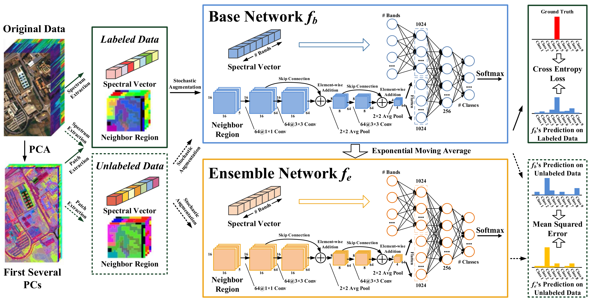

# Robust Self-Ensembling Network for Hyperspectral Image Classification



This is the official PyTorch implementation of the paper [Robust Self-Ensembling Network for Hyperspectral Image Classification](https://arxiv.org/abs/2104.03765)


## Preparation
* Install required packages: `pip install -r requirements.txt`

* Download the [Pavia University image](http://www.ehu.eus/ccwintco/uploads/e/ee/PaviaU.mat) and the corresponding [annotations](http://www.ehu.eus/ccwintco/uploads/5/50/PaviaU_gt.mat). Put these files into the `dataset` folder.

## Usage
* Data Preparation:
```
$ python sample_generation.py
``` 

  The default training set is generated by randomly selecting `30` labeled samples from each category.
  
  You can change parameter `--num_label` to check the performance in other training scenarios.
  
* Performance Evaluation:
```
$ CUDA_VISIBLE_DEVICES=0 python train_RSEN.py
```

## Paper
[Robust Self-Ensembling Network for Hyperspectral Image Classification](https://ieeexplore.ieee.org/document/9862940)

Please cite our paper if you find it useful for your research.

```
@article{rsen,
  title={Robust Self-Ensembling Network for Hyperspectral Image Classification}, 
  author={Xu, Yonghao and Du, Bo and Zhang, Liangpei},
  journal={IEEE Trans. Neural Netw. Learn. Syst.}, 
  volume={},
  number={},
  pages={},
  year={2022},
  doi={10.1109/TNNLS.2022.3198142}}
}
```

